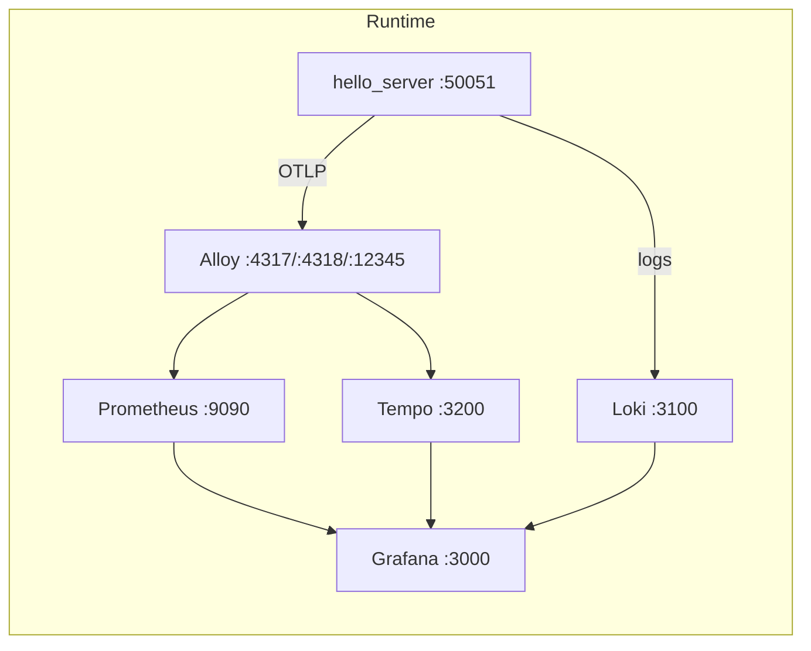

# hello_server

一个面向 Linux 嵌入式 / 边缘设备的 C++20 gRPC 服务骨架，内置版本化构建、容器化交付、日志、Tracing、Metrics 和完整的可观测性联调环境。

项目当前聚焦 Linux 用户态服务，不包含 BSP、内核、驱动或总线协议栈。

## Features

- C++20 + gRPC + Protobuf 的最小服务骨架
- 内置 gRPC Health Check 与 Server Reflection
- 基于 spdlog 的控制台 + 滚动文件日志
- 基于 OpenTelemetry 的 Trace / Metrics 导出
- 基于 Grafana Alloy、Prometheus、Loki、Tempo、Grafana 的观测链路
- 基于 CMake Presets、Conan 2、Clang 18 的工程化构建
- 产出可分发的版本化部署目录和产品镜像

## Architecture



运行时默认暴露：

- gRPC: 50051
- Grafana: 3000
- Prometheus: 9090
- Loki: 3100
- Tempo: 3200
- Alloy UI: 12345

## Layout

```text
.
├── common/
│   ├── logger/           # 日志初始化与文件保留策略
│   └── telemetry/        # Trace、Metrics 与 gRPC 观测封装
├── services/
│   ├── proto/            # .proto 定义与代码生成
│   └── server/           # 服务入口与路由实现
├── config/               # Alloy / Prometheus / Loki / Tempo / Grafana 配置
├── docs/                 # 补充文档
├── package/              # 产品镜像打包模板
├── products/             # 安装产物与版本化部署目录
├── CMakeLists.txt
├── CMakePresets.json
├── conanfile.py
├── build.sh
├── build_in_docker.sh
├── docker-compose.yaml
└── version.txt
```

## Quick Start

推荐路径是在 builder 容器中构建，然后直接从版本化产物目录启动完整环境。

```sh
./build_in_docker.sh Server_Release
cd products/bin1.0.0
./start_service.sh
docker compose ps
```

启动后可访问：

- [Grafana](http://localhost:3000)
- [Prometheus](http://localhost:9090)
- [Alloy UI](http://localhost:12345)
- gRPC: localhost:50051

最小验证：

```sh
docker compose exec service grpc_health_probe --addr 127.0.0.1:50051
grpcurl -plaintext localhost:50051 list
```

如果本机没有安装 grpcurl，可只执行健康检查。

## Build

### Prerequisites

- Linux，推荐 Ubuntu 22.04 或兼容环境
- Docker 和 docker compose
- 首次构建可访问 Conan 远端与 Docker Hub

### Build Presets

- Server_Release
- Server_Debug

### Common Commands

在宿主机直接构建：

```sh
./build.sh Server_Release
```

在 builder 镜像内构建：

```sh
./build_in_docker.sh Server_Release
```

手动执行 Conan + CMake：

```sh
conan install . \
  --profile:all=./conanfile/linux_x86_64_release \
  --build=missing \
  -c tools.system.package_manager:mode=install

cmake --preset Server_Release
cmake --build --preset Server_Release -j"$(nproc)"
cmake --install build/Release
```

构建完成后，主要产物位于：

- products/bin1.0.0
- build/Release
- build/compile_commands.json

## Run

### Full Stack

```sh
cd products/bin1.0.0
./start_service.sh
```

停止：

```sh
cd products/bin1.0.0
./stop_service.sh
```

### Single Process

单独运行服务时，需保证日志目录和 OTLP 端点可用：

```sh
mkdir -p /workspace/logs
export TELEMETRY_OTLP_ENDPOINT=localhost:4317
./products/bin1.0.0/main
```

当前服务提供一个最小 RPC：

```proto
service ServerMessagesService {
  rpc CheckOnline(CheckOnlineRequest) returns (CheckOnlineReply) {}
}
```

## Configuration

最常见的配置入口：

- version.txt: 项目版本与安装目录版本号
- .env: builder、runtime、product 镜像名
- CMakePresets.json: Debug / Release 预设
- docker-compose.yaml: 运行栈编排

关键运行时环境变量：

- TELEMETRY_OTLP_ENDPOINT，默认单进程为 localhost:4317，Compose 下为 alloy:4317

默认日志目录：

- /workspace/logs

如果需要调整端口、镜像名或观测链路，优先同步检查 docker-compose.yaml 和 config/ 下对应配置。

## Development

推荐在 Dev Container 或 builder 镜像中开发，以保持与默认工作目录、工具链和日志路径一致。

代码入口：

- common/logger: 日志初始化
- common/telemetry: Telemetry 初始化与观测封装
- services/proto/server_messages.proto: RPC 定义
- services/server/src/hello_server.cpp: 服务入口
- services/server/src/routes: 路由实现

工程约束：

- C++20
- CMake 3.22+
- Conan 2
- Clang 18
- clang-format 与 clang-tidy 已接入构建流程

## Test

仓库当前没有提交自动化测试框架，也没有启用 CTest。

现阶段建议的回归方式：

```sh
./build_in_docker.sh Server_Release
cd products/bin1.0.0
./start_service.sh
docker compose exec service grpc_health_probe --addr 127.0.0.1:50051
curl -fsSL http://localhost:9090/-/healthy
curl -fsSL http://localhost:3000/api/health
./stop_service.sh
```

## Observability

服务默认接入以下观测组件：

- Logs: spdlog -> Alloy -> Loki
- Metrics: hello_server / node-exporter -> Prometheus -> Grafana
- Traces: OpenTelemetry -> Alloy -> Tempo -> Grafana

本地联调时优先查看：

- [Grafana](http://localhost:3000)
- [Prometheus](http://localhost:9090)
- [Alloy UI](http://localhost:12345)

## Documentation

README 只保留入口级信息。补充内容见：

- [docs/docker.md](docs/docker.md)
- [docs/clang-format.md](docs/clang-format.md)
- [docs/clang-tidy.md](docs/clang-tidy.md)

源码级入口：

- [common/logger](common/logger)
- [common/telemetry](common/telemetry)
- [services/proto](services/proto)
- [services/server](services/server)

## Contributing

建议流程：

1. 从 develop 或当前团队约定分支切出主题分支。
2. 保持改动聚焦，并同步更新相关脚本、配置或文档。
3. 至少完成一次 Release 构建和一次基本运行验证。
4. 使用 Conventional Commits 风格提交消息，例如 feat(metrics): add rpc metrics。

提交前建议执行：

```sh
./build_in_docker.sh Server_Release
cd products/bin1.0.0
./start_service.sh
docker compose exec service grpc_health_probe --addr 127.0.0.1:50051
./stop_service.sh
```

## License

本项目使用 GNU General Public License v2.0。详见 [LICENSE](LICENSE)。
