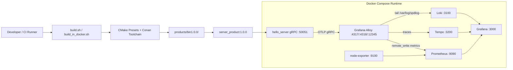

# hello_server

一个面向 Linux 嵌入式/边缘设备场景的 C++20 gRPC 服务工程骨架，集成了版本化构建、容器化交付、日志、Tracing、Metrics 与可观测性栈。当前仓库已经具备从源码构建到产品镜像打包，再到 Grafana / Prometheus / Loki / Tempo 联调的完整工程闭环。

> **范围说明**
>
> 当前仓库是 **Linux 用户态服务工程**，不是 BSP/SDK/内核仓库。代码树中 **没有** Linux 内核源码、设备树、内核模块、驱动源码、HAL 层封装，也 **没有** SPI/I2C/UART/CAN/Modbus 等总线协议实现。现阶段对外接口以 **gRPC** 为主，观测链路使用 **OTLP / Prometheus / Loki / Tempo / Grafana**。

## 1. 项目简介

`hello_server` 当前实现了一个最小但工程化完整的 gRPC 服务：

- 提供 `ServerMessagesService/CheckOnline` RPC；
- 启用 gRPC 健康检查与 Server Reflection；
- 使用 `spdlog` 输出控制台与滚动文件日志；
- 使用 `opentelemetry-cpp` 导出 Trace 与 Metrics；
- 通过 `Grafana Alloy` 将 Metrics 转发到 Prometheus、将 Trace 转发到 Tempo、将日志采集到 Loki；
- 通过 `Docker Compose` 启动服务与整套可观测性组件；
- 通过 `CMake + Conan 2 + Clang 18` 组织编译、依赖和静态检查；
- 通过 `products/bin<version>/` 生成可分发的版本化部署目录。

它适合作为以下项目的基础骨架：

- 嵌入式 Linux 设备上的常驻后台服务；
- 需要统一日志、指标、链路追踪的边缘服务；
- 需要版本化打包与容器化交付的工业现场网关服务；
- 需要从“单 RPC 样例”逐步演进为真实业务服务的工程模板。

## 2. 系统架构



### 运行时组件职责

| 组件 | 位置 | 作用 |
| --- | --- | --- |
| `main` | `services/server` | gRPC 服务进程，监听 `0.0.0.0:50051` |
| `LoggerLib` | `common/logger` | 初始化异步日志、滚动文件、保留策略 |
| `TelemetryLib` | `common/telemetry` | 初始化 OTel Tracer/Meter、Trace 上下文传播、gRPC 服务端指标拦截器 |
| `Grafana Alloy` | `docker-compose.yaml` + `config/alloy` | OTLP 接收器、日志采集、Prometheus remote_write |
| `Prometheus` | `config/prometheus` | 存储与查询 Metrics |
| `Loki` | `config/loki` | 存储结构化日志文件流 |
| `Tempo` | `config/tempo` | 存储 Trace |
| `Grafana` | `config/grafana` | 统一查看日志、指标、Trace |
| `node-exporter` | `docker-compose.yaml` | 暴露宿主机资源指标 |

### 嵌入式/工业部署边界

当前仓库的“嵌入式属性”主要体现在：

- 目标环境是 **Linux 设备**；
- 已预置 `x86_64` 与 `aarch64` Conan Profile；
- 运行态关注 **日志保留、核心转储、容器化交付、边缘可观测性**；
- 适合作为设备侧应用层服务，而不是裸机固件或内核驱动工程。

## 3. 目录结构说明

```text
.
├── CMakeLists.txt
├── CMakePresets.json
├── Dockerfile
├── Dockerfile.runtime
├── build.sh
├── build_in_docker.sh
├── build_product_image.sh
├── start_service.sh
├── stop_service.sh
├── conanfile.py
├── conanfile/
│   ├── linux_x86_64_release
│   ├── linux_x86_64_debug
│   ├── linux_aarch64_release
│   └── linux_aarch64_debug
├── cmake/
│   ├── CommonConfig.cmake
│   ├── ClangTools.cmake
│   └── VersionConfig.cmake
├── common/
│   ├── logger/
│   │   ├── CMakeLists.txt
│   │   ├── logger.hpp
│   │   └── logger.cpp
│   └── telemetry/
│       ├── CMakeLists.txt
│       ├── telemetry.hpp
│       └── telemetry.cpp
├── services/
│   ├── proto/
│   │   ├── CMakeLists.txt
│   │   └── server_messages.proto
│   └── server/
│       ├── CMakeLists.txt
│       └── src/
│           ├── hello_server.cpp
│           └── routes/
│               ├── routes.hpp
│               └── routes.cpp
├── config/
│   ├── alloy/
│   ├── prometheus/
│   ├── loki/
│   ├── tempo/
│   └── grafana/
├── docs/
│   ├── clang-format.md
│   ├── clang-tidy.md
│   └── docker.md
├── package/
│   └── Dockerfile
├── products/
│   └── bin1.0.0/
└── .devcontainer/
```

### 关键目录职责

| 路径 | 作用 |
| --- | --- |
| `common/logger` | 日志初始化、滚动文件、总量清理、异步日志线程池 |
| `common/telemetry` | Trace/Metrics 初始化、W3C Trace Context 传播、gRPC 指标拦截 |
| `services/proto` | `.proto` 定义与 gRPC/Protobuf 代码生成 |
| `services/server` | 服务入口与业务路由实现 |
| `config/` | 运行态可观测性组件配置 |
| `cmake/` | 版本注入、编译选项、clang-format / clang-tidy 集成 |
| `conanfile.py` + `conanfile/` | 第三方依赖与构建 Profile |
| `package/Dockerfile` | 产品镜像打包模板 |
| `products/bin<version>/` | 安装后的二进制、配置与部署脚本输出目录 |
| `.devcontainer/` | VS Code 开发容器定义 |
| `docs/` | 代码风格、静态检查、镜像构建说明 |

### 约定目录现状

下表用于说明仓库中“常见工程目录”的实际情况，避免误读：

| 目录 | 当前状态 | 实际承载位置 |
| --- | --- | --- |
| `scripts/` | **不存在** | 根目录 `build.sh`、`build_in_docker.sh`、`start_service.sh`、`stop_service.sh` |
| `tools/` | **不存在** | 工具链由 `Dockerfile`、`.devcontainer/`、Conan 管理 |
| `tests/` | **不存在** | 当前未提交自动化测试框架 |
| `third_party/` | **不存在** | 依赖通过 Conan 与容器镜像获取 |
| `deploy/` | **不存在** | 部署资产由 `products/` 与 `docker-compose.yaml` 承载 |
| `monitoring/` | **不存在** | 监控与日志配置位于 `config/` |
| `docker/` | **不存在** | Docker 资产位于根目录与 `package/` |

## 4. 技术栈

| 层级 | 当前实现 |
| --- | --- |
| 语言标准 | C++20 |
| 构建系统 | CMake 3.22+ |
| 依赖管理 | Conan 2 |
| 编译器 | Clang 18（默认），Unix Makefiles 生成器 |
| RPC | gRPC 1.67.1 + Protobuf 5.27.0 |
| 日志 | spdlog 1.13.0 |
| Tracing / Metrics | opentelemetry-cpp 1.14.2 |
| 容器运行 | Docker + Docker Compose |
| 可观测性 | Grafana Alloy, Prometheus, Loki, Tempo, Grafana, node-exporter |
| 开发环境 | VS Code Dev Containers + clangd + LLDB 扩展 |
| 代码格式 | `.clang-format` |
| 静态检查 | `.clang-tidy` |

## 5. 环境要求

| 项目 | 要求 |
| --- | --- |
| 操作系统 | Linux，推荐 Ubuntu 22.04 或兼容环境 |
| CPU 架构 | 当前主流程面向 `x86_64`；仓库同时提供 `aarch64` Conan Profile |
| Docker | 需要支持 `docker`, `docker compose`, 本地镜像构建与容器运行 |
| 网络 | 首次构建需要访问 Conan 远端与 Docker Hub |
| 权限 | 运行态 Compose 使用 `privileged: true`，宿主机需允许特权容器 |
| 挂载目录 | `/const`、`/user_profiles`、`/corefile`、`/var/log/spdlog` 应在目标机存在并具备访问权限 |
| 端口开放 | `50051`, `3000`, `3100`, `3200`, `4317`, `4318`, `9090`, `9100`, `12345` |

## 6. 工具链要求

### 本地/CI 编译链

| 工具 | 版本/要求 | 来源 |
| --- | --- | --- |
| CMake | `>= 3.22` | `conanfile.py` 中 `tool_requires("cmake/3.22.6")` |
| Conan | 2.x | `Dockerfile` 中 `pip3 install conan` |
| Clang / Clang++ | 18 | 根目录 `Dockerfile` 配置为系统默认编译器 |
| Make | GNU Make | `CMakePresets.json` 使用 `Unix Makefiles` |
| Python | 3.x | Conan 运行所需 |

### 交叉编译现状

仓库已提供：

- `conanfile/linux_aarch64_release`
- `conanfile/linux_aarch64_debug`
- 构建镜像中的 `binutils-aarch64-linux-gnu`
- 开发容器中的 `qemu-aarch64-static` 挂载

但当前根脚本默认依据 `uname -m` 自动选择同架构 Conan Profile，且仓库中未提交独立 sysroot / SDK / BSP 配置。因此：

- **同架构构建** 已具备开箱即用条件；
- **跨架构构建** 具备基础准备，但在真实板卡接入前仍需确认目标 sysroot、运行库与链接链路。

## 7. 快速开始

### 推荐路径：容器内构建 + 产品目录启动

```sh
# 1) 在仓库根目录执行 Release 构建
./build_in_docker.sh Server_Release

# 2) 进入版本化产物目录
cd products/bin1.0.0

# 3) 启动服务与可观测性栈
./start_service.sh

# 4) 查看运行状态
docker compose ps
```

启动后可访问：

| 入口 | 地址 |
| --- | --- |
| gRPC 服务 | `localhost:50051` |
| Grafana | `http://localhost:3000` |
| Prometheus | `http://localhost:9090` |
| Loki | `http://localhost:3100` |
| Tempo | `http://localhost:3200` |
| Alloy UI | `http://localhost:12345` |
| Node Exporter | `http://localhost:9100/metrics` |

### 首次环境准备

如果本地尚未准备构建/运行镜像，可先构建：

```sh
docker build . -f Dockerfile -t docker.io/twelfive5t/server_builder
docker build . -f Dockerfile.runtime -t docker.io/twelfive5t/server_minimal_runtime:v1
```

如果你直接使用仓库默认 `.env` 中的镜像名，也可以让 `build_in_docker.sh` 自动拉取远端镜像。

## 8. 编译方法

### 8.1 使用封装脚本构建

| 命令 | 用途 | 产物 |
| --- | --- | --- |
| `./build.sh Server_Release` | 本机直接构建 Release | `build/Release/`, `products/bin1.0.0/`, 产品镜像 |
| `./build_in_docker.sh Server_Release` | 在 builder 镜像内构建 Release | 同上 |
| `./build.sh Server_Debug` | 本机直接构建 Debug | `build/Debug/` |

`build.sh` 的实际流程：

1. 根据 Preset 选择 Conan Profile；
2. 若 `build/<type>/generators/conan_toolchain.cmake` 不存在，则执行 `conan install`；
3. 执行 `cmake --preset ...`；
4. 执行 `cmake --build --preset ...`；
5. 执行 `cmake --install build/<type>`；
6. 调用 `build_product_image.sh` 生成产品镜像。

### 8.2 手动执行 Conan + CMake

```sh
conan install . \
    --profile:all=./conanfile/linux_x86_64_release \
    --build=missing \
    -c tools.system.package_manager:mode=install

cmake --preset Server_Release
cmake --build --preset Server_Release -j"$(nproc)"
cmake --install build/Release
```

### 8.3 构建输出说明

| 输出 | 说明 |
| --- | --- |
| `build/Release` / `build/Debug` | CMake 构建目录 |
| `build/compile_commands.json` | 由 `CommonConfig.cmake` 复制到固定路径，供 clangd/IDE 使用 |
| `products/bin1.0.0/main` | 安装后的主程序 |
| `products/bin1.0.0/config/` | 打包后的监控配置 |
| `docker.io/twelfive5t/server_product:1.0.0` | 产品镜像名，来自 `.env` |

## 9. 运行方法

### 9.1 以产品目录方式运行

```sh
cd products/bin1.0.0
./start_service.sh
```

停止服务：

```sh
cd products/bin1.0.0
./stop_service.sh
```

### 9.2 以单进程方式运行

服务可直接运行二进制，但需要注意两个约束：

1. 日志目录在代码中固定为 **`/workspace/logs`**；
2. `TELEMETRY_OTLP_ENDPOINT` 默认值为 **`localhost:4317`**。

示例：

```sh
mkdir -p /workspace/logs
export TELEMETRY_OTLP_ENDPOINT=localhost:4317
./products/bin1.0.0/main
```

### 9.3 服务接口

当前 proto 仅定义一个 RPC：

```proto
service ServerMessagesService {
  rpc CheckOnline (CheckOnlineRequest) returns (CheckOnlineReply) {}
}
```

服务同时启用了：

- gRPC Health Check；
- gRPC Reflection。

如果宿主机安装了 `grpcurl`，可直接做最小验证：

```sh
grpcurl -plaintext localhost:50051 list
grpcurl -plaintext localhost:50051 describe ServerMessages.ServerMessagesService
```

## 10. 配置说明

### 10.1 版本与镜像配置

| 文件 | 作用 |
| --- | --- |
| `version.txt` | 项目版本号；影响 `project(hello_server VERSION ...)` 与安装路径 `bin<version>` |
| `.env` | Builder/Runtime/Product 镜像名及版本；Compose 会自动读取 |
| `CMakePresets.json` | `Server_Debug` / `Server_Release` 预设 |

当前 `.env` 的关键变量如下：

| 变量 | 当前值 |
| --- | --- |
| `SERVER_VERSION` | `1.0.0` |
| `BUILDER_IMAGE` | `docker.io/twelfive5t/server_builder` |
| `PRODUCT_IMAGE` | `docker.io/twelfive5t/server_product:1.0.0` |
| `RUNTIME_IMAGE` | `docker.io/twelfive5t/server_minimal_runtime:v1` |

### 10.2 可观测性配置

| 文件 | 作用 |
| --- | --- |
| `config/alloy/config.alloy` | OTLP 接收、Prometheus remote_write、Loki 文件采集 |
| `config/prometheus/prometheus.yml` | Prometheus 抓取配置，当前抓取 `prometheus` 与 `node-exporter` |
| `config/loki/loki-config.yaml` | Loki 本地文件存储与日志保留 |
| `config/tempo/tempo.yaml` | Tempo OTLP 接收与本地存储 |
| `config/grafana/provisioning/datasources/*.yaml` | Grafana 数据源自动注册 |

### 10.3 运行时环境变量

| 变量 | 默认值 | 说明 |
| --- | --- | --- |
| `TELEMETRY_OTLP_ENDPOINT` | `localhost:4317` | `hello_server` 导出 Trace/Metrics 的 OTLP gRPC 端点 |

在 Compose 运行时，该变量已被设置为：

```sh
TELEMETRY_OTLP_ENDPOINT=alloy:4317
```

## 11. 日志与可观测性

### 11.1 日志系统

日志由 `common/logger/logger.cpp` 初始化，特性如下：

| 项目 | 当前实现 |
| --- | --- |
| 输出方式 | 控制台 + 文件双输出 |
| 日志库 | `spdlog::async_logger` |
| 文件目录 | `/workspace/logs` |
| 文件名前缀 | `spdlog_YYYYMMDD_HHMMSS.log` |
| 单文件大小 | `10 MiB` |
| 单进程最多文件数 | `5` |
| 总目录上限 | `512 MiB` |
| 保留期 | `30 天` |
| 刷盘策略 | `error` 级别立即刷盘，常规每 `2s` 刷盘 |

Compose 中将该目录挂载到宿主机：

```text
/var/log/spdlog -> /workspace/logs
```

### 11.2 Trace

Trace 由 `TelemetryLib` 初始化，当前行为：

- 使用 **OTLP gRPC Exporter**；
- 默认 `service.name=hello_server`；
- 默认 `service.version=0.0.1`；
- 默认 `deployment.environment=test`；
- 支持从 gRPC `ServerContext` 提取远端 Trace Context；
- 支持以 W3C `traceparent` / `tracestate` 注入下游请求；
- 支持通过自定义 `ignore_sampler` 与 `manual_drop` 属性丢弃 Span；
- 通过 `trace_span` RAII 封装简化埋点。

### 11.3 Metrics

服务端指标由 gRPC Interceptor 统一采集，不在业务处理函数中显式埋点：

| 指标 | 语义 |
| --- | --- |
| `rpc.server.requests` | 服务端请求计数 |
| `rpc.server.duration` | 服务端请求耗时直方图 |

当前 `PeriodicExportingMetricReader` 配置：

| 项目 | 当前值 |
| --- | --- |
| 导出周期 | `15s` |
| 导出超时 | `5s` |

### 11.4 观测链路

```text
hello_server
  ├─ OTLP traces/metrics ──> Alloy
  │                           ├─ traces ──> Tempo
  │                           └─ metrics ─> Prometheus
  └─ spdlog files ──────────> Alloy ──────> Loki

node-exporter ──────────────> Prometheus
Grafana ────────────────────> Tempo / Loki / Prometheus
```

Grafana 数据源已完成自动注册，并配置了：

- Trace → Logs 关联；
- Trace → Metrics 关联；
- Tempo Node Graph；
- 基于 `service.name` 的查询映射。

## 12. 调试指南

### 12.1 本地调试建议路径

推荐优先使用 **Dev Container** 或 **Builder 镜像** 进行调试，原因如下：

- 仓库默认工作目录为 `/workspace`；
- 日志路径硬编码为 `/workspace/logs`；
- Conan、Clang、Docker CLI、QEMU 挂载已在容器中预置；
- `.devcontainer/devcontainer.json` 已声明 clangd、clang-format、CMake、LLDB 等扩展。

### 12.2 常用调试命令

```sh
# 查看 Compose 服务状态
docker compose -f docker-compose.yaml ps

# 查看主服务日志
docker compose -f docker-compose.yaml logs -f service

# 在容器内执行 gRPC 健康探测
docker compose -f docker-compose.yaml exec service \
    grpc_health_probe --addr 127.0.0.1:50051

# 查看文件日志
ls -lh /var/log/spdlog
tail -f /var/log/spdlog/*.log
```

### 12.3 静态调试与 IDE 支持

| 能力 | 现状 |
| --- | --- |
| `compile_commands.json` | 自动复制到 `build/compile_commands.json` |
| clangd | Dev Container 已推荐安装 |
| clang-format | CMake 中提供 `format` 目标，且默认参与构建 |
| clang-tidy | 默认开启，新的 target 自动继承 |
| LLDB | Dev Container 推荐扩展已配置 |

### 12.4 Sanitizer / Coverage

`cmake/CommonConfig.cmake` 已提供以下开关：

- `ENABLE_COVERAGE`
- `ENABLE_SANITIZE_THREAD`
- `ENABLE_SANITIZE_ADDRESS`

示例：

```sh
cmake --preset Server_Debug -DENABLE_SANITIZE_ADDRESS=ON
cmake --build --preset Server_Debug -j"$(nproc)"
```

### 12.5 Core Dump

产品镜像 `package/Dockerfile` 会尝试设置：

```text
kernel.core_pattern=/corefile/core.%e.%p.%s.%E
```

Compose 同时挂载：

```text
/corefile -> /corefile
```

因此生产调试应重点关注：

- `/corefile` 是否可写；
- 宿主机是否允许容器相关 `sysctl` 生效；
- 是否需要结合 `gdb` / `lldb` 与对应符号文件分析转储。

## 13. 测试方法

### 当前测试现状

仓库目前 **未提交** 以下内容：

- `tests/` 目录；
- `enable_testing()` / `add_test()` / `ctest` 配置；
- gtest / Catch2 / doctest 等单元测试框架；
- GitHub Actions / GitLab CI 中的自动测试流水线。

也就是说，当前工程的验证方式主要是 **构建成功 + 静态检查 + 运行烟雾测试 + 可观测性验证**。

### 建议的现行回归步骤

```sh
# 1) 构建 Release 制品
./build_in_docker.sh Server_Release

# 2) 启动系统
cd products/bin1.0.0
./start_service.sh

# 3) 检查主服务是否健康
docker compose exec service grpc_health_probe --addr 127.0.0.1:50051

# 4) 检查观测链路
curl -fsSL http://localhost:9090/-/healthy
curl -fsSL http://localhost:3000/api/health
```

### 手工 RPC 验证

如果本机安装了 `grpcurl`：

```sh
grpcurl -plaintext localhost:50051 list
grpcurl -plaintext localhost:50051 ServerMessages.ServerMessagesService/CheckOnline
```

## 14. 部署流程

当前仓库的部署单元不是裸机可执行文件包，而是 **版本化产品目录 + 产品镜像**。

### 标准部署步骤

1. 在源码仓库执行 Release 构建；
2. 生成 `products/bin<version>/`；
3. `build_product_image.sh` 将该目录构造成产品镜像；
4. 将产品目录或镜像分发到目标设备；
5. 在目标设备准备宿主机挂载目录；
6. 通过 `./start_service.sh` 启动。

### 目标机准备

```sh
sudo mkdir -p /const /user_profiles /corefile /var/log/spdlog
sudo chmod 777 /corefile /var/log/spdlog
```

### 部署目录内容

`products/bin1.0.0/` 当前包含：

- `main`
- `.env`
- `docker-compose.yaml`
- `start_service.sh`
- `stop_service.sh`
- `Dockerfile`
- `config/`

这意味着该目录本身就是可分发部署包。

## 15. 固件升级流程

### 当前实现边界

仓库目前 **没有** MCU Bootloader、A/B 分区、OTA Agent、固件包签名或内核/根文件系统升级逻辑。

在当前工程里，“升级”实际等价于：

> **升级容器镜像与版本化部署目录**

### 推荐升级流程

```sh
# 1) 停止旧版本
cd /path/to/old/products/bin1.0.0
./stop_service.sh

# 2) 备份现场数据
sudo tar czf backup-$(date +%F-%H%M%S).tar.gz \
    /const /user_profiles /var/log/spdlog /corefile

# 3) 下发新版本目录或新镜像
# 例如：products/bin1.0.1/

# 4) 启动新版本
cd /path/to/new/products/bin1.0.1
./start_service.sh
```

### 回滚策略

当前最可靠的回滚方式是：

1. 保留上一版本 `products/bin<old-version>/`；
2. 保留上一版本产品镜像标签；
3. 新版本异常时执行 `./stop_service.sh`；
4. 回到旧版本目录重新 `./start_service.sh`。

### 升级注意事项

- `/const` 与 `/user_profiles` 属于外部挂载数据，不应随镜像覆盖；
- `/var/log/spdlog` 与 `/corefile` 中可能含有故障现场信息，升级前建议保留；
- 当前 Compose 不是滚动升级模型，升级期间存在短暂停机窗口。

## 16. 常见问题

### Q1: `conan_toolchain.cmake` 找不到或依赖未解析

优先检查：

- Conan 2 是否已安装；
- `~/.conan2` 是否可写；
- 网络是否可访问 Conan 远端；
- 选用的 Profile 是否与当前架构匹配。

### Q2: 容器启动了，但 Grafana/Prometheus 中看不到数据

优先检查：

- `TELEMETRY_OTLP_ENDPOINT` 是否指向 `alloy:4317`；
- `alloy`、`prometheus`、`tempo`、`loki` 是否已全部启动；
- `config/alloy/config.alloy` 是否已随产品目录一起打包；
- 是否有请求流量触发 `rpc.server.requests` 与 `rpc.server.duration`。

### Q3: 单进程运行时日志没有落盘

日志目录在代码中固定为 `/workspace/logs`。如果你不在容器或 `/workspace` 目录下运行，需要显式创建该路径并确保有写权限。

### Q4: 为什么仓库里没有 `tests/` 目录

因为当前工程仍处于“服务骨架 + 部署与观测基础设施优先”阶段。现阶段测试以静态检查、构建验证、健康检查和手工 RPC 冒烟为主。

### Q5: 端口冲突怎么办

当前默认端口较多，常见冲突端口包括 `3000`, `50051`, `9090`, `3100`, `3200`, `4317`, `4318`。如需调整，应同步修改：

- `docker-compose.yaml`
- `config/grafana/provisioning/datasources/*.yaml`
- 观测与运维文档

## 17. 性能优化建议

基于当前代码实现，优先考虑以下优化点：

1. **始终以 `Server_Release` 交付生产版本**：`CommonConfig.cmake` 中 Release 已启用 `-O3`。
2. **为 Telemetry 后台线程规划 CPU 亲和性**：`telemetry_config.background_cpu_affinity` 已预留能力，可降低观测线程对实时业务核的干扰。
3. **为高频无价值路径配置 `ignored_spans`**：减少 Span 创建与导出开销。
4. **控制日志量**：当前日志为 `debug` 级别且控制台/文件双输出，若业务扩大，应分级裁剪。
5. **关注磁盘写放大**：日志目录上限 `512 MiB`，在 eMMC/SSD 设备上应结合设备寿命评估。
6. **调优 OTLP 导出批处理参数**：当前 Metrics 导出周期为 `15s`，可根据现场带宽与延迟要求调整。
7. **Prometheus 抓取面向宿主机与服务指标分层**：当前只显式抓取 `prometheus` 与 `node-exporter`，如后续增加 exporter，应避免无序扩展。
8. **使用外部 Linux 分析工具做热点排查**：仓库未内建 `perf`/FlameGraph 流程，但在目标机上可直接配合 `perf top`, `perf record`, `perf report` 分析 `main`。

## 18. 开发规范

### 代码规范

仓库当前规范以以下文件为准：

- `.clang-format`
- `.clang-tidy`
- `docs/clang-format.md`
- `docs/clang-tidy.md`

其中 **根目录配置文件是最终约束源**，文档用于解释规则。

### 已落实的工程约束

| 约束 | 当前实现 |
| --- | --- |
| 语言标准 | `CMAKE_CXX_STANDARD 20` |
| 命名风格 | 倾向 Linux 风格 `snake_case` |
| 大括号风格 | `BreakBeforeBraces: Linux` |
| 格式化 | `format` 目标默认加入构建 |
| 静态检查 | `clang-tidy` 默认开启，警告视为错误 |
| proto 生成代码 | 通过 `SYSTEM` include + `CXX_CLANG_TIDY ""` 避免误报 |
| 异常边界 | `main()` 统一捕获异常并记录日志 |

### 开发建议

- 公共基础设施放在 `common/`，业务服务放在 `services/`；
- 新增 RPC 时先更新 `.proto`，再落业务逻辑；
- 端口、镜像名、观测配置变更时同步更新 `config/` 与部署脚本；
- 对性能敏感路径新增埋点时，优先复用 `trace_span` 与统一指标模型。

## 19. Git 提交规范

从当前仓库历史可以看出，提交消息已经采用接近 **Conventional Commits** 的格式：

```text
feat(metrics): 添加 gRPC 服务端指标收集功能并优化相关代码
fix(build): 修复 build_in_docker 脚本
chore(devcontainer): 挂载宿主 zsh 历史到开发容器
```

### 推荐格式

```text
<type>(<scope>): <简洁描述>
```

### 常用类型

| 类型 | 适用场景 |
| --- | --- |
| `feat` | 新功能 |
| `fix` | 缺陷修复 |
| `build` | 构建系统、镜像、依赖、脚本 |
| `docs` | 文档更新 |
| `refactor` | 重构，不改变外部行为 |
| `test` | 测试与验证资产 |
| `chore` | 杂项维护 |

### 分支现状

当前仓库可见长期分支至少包括：

- `main`
- `develop`

若无额外团队约定，建议：

1. 从 `develop` 或当前活跃开发分支切出特性分支；
2. 完成构建、静态检查与烟雾验证；
3. 通过 Pull Request 合入。

## 20. CI/CD 流程

### 当前仓库状态

仓库 **未提交** `.github/workflows/` 或其他显式 CI 配置文件，因此目前的 CI/CD 更接近“**脚本化工程流水线**”，而不是“仓库内声明式流水线”。

### 当前可复用的流水线步骤

| 阶段 | 实现文件 | 说明 |
| --- | --- | --- |
| 环境准备 | `Dockerfile`, `Dockerfile.runtime` | 构建 Builder / Runtime 基础镜像 |
| 依赖解析 | `conanfile.py`, `conanfile/*` | 解析并安装 C++ 依赖 |
| 编译 | `build.sh` / `build_in_docker.sh` | 执行 Conan + CMake + Install |
| 质量门禁 | `cmake/ClangTools.cmake` | clang-format / clang-tidy 融入构建 |
| 打包 | `build_product_image.sh`, `package/Dockerfile` | 生成产品目录与产品镜像 |
| 部署 | `start_service.sh`, `stop_service.sh`, `docker-compose.yaml` | 启停完整运行栈 |
| 运行后验证 | Grafana / Prometheus / health probe | 观测与健康校验 |

### 接入外部 CI 的建议命令

在任意 CI Runner 中，最小可复用流程如下：

```sh
./build_in_docker.sh Server_Release
cd products/bin1.0.0
docker compose up -d
docker compose exec service grpc_health_probe --addr 127.0.0.1:50051
docker compose down
```

## 21. 第三方依赖说明

### Conan 依赖

| 依赖 | 版本 | 用途 |
| --- | --- | --- |
| `spdlog` | `1.13.0` | 日志 |
| `protobuf` | `5.27.0` | 消息定义与序列化 |
| `grpc` | `1.67.1` | RPC 框架 |
| `opentelemetry-cpp` | `1.14.2` | Trace / Metrics |
| `cmake` | `3.22.6` | Conan `tool_requires` |

### 运行时镜像依赖

| 组件 | 镜像 |
| --- | --- |
| 主服务产品镜像 | `docker.io/twelfive5t/server_product:1.0.0` |
| Builder 基础镜像 | `docker.io/twelfive5t/server_builder` |
| Runtime 基础镜像 | `docker.io/twelfive5t/server_minimal_runtime:v1` |
| Alloy | `grafana/alloy:latest` |
| Prometheus | `prom/prometheus:v3.11.0` |
| Loki | `grafana/loki:latest` |
| Tempo | `grafana/tempo:latest` |
| Grafana | `grafana/grafana:latest` |
| node-exporter | `prom/node-exporter:latest` |

### 额外说明

- 仓库没有 `third_party/` 目录；
- 依赖解析完全依赖 Conan 与容器镜像；
- Runtime 镜像会安装 `grpc_health_probe`，供 Compose 健康检查使用；
- Dev Container 会额外安装 `oh-my-zsh`、`powerlevel10k`、`zsh-autosuggestions` 等开发体验工具，但它们不属于生产依赖。

## 22. 安全注意事项

当前默认配置更偏向 **开发联调便利性**，不是直接可上线的零信任生产配置。重点风险如下：

| 风险点 | 当前状态 |
| --- | --- |
| gRPC 传输加密 | 使用 `grpc::InsecureServerCredentials()`，**未启用 TLS/mTLS** |
| Grafana 认证 | 匿名访问开启，且匿名角色为 `Admin` |
| Loki 认证 | `auth_enabled: false` |
| 容器权限 | 多个服务启用 `privileged: true` |
| 端口暴露 | 多个端口默认监听宿主机全部地址 |
| 服务鉴权 | 当前 RPC 无认证/鉴权逻辑 |
| Reflection | 默认开启，便于调试但会暴露接口元数据 |
| 日志/转储 | `/var/log/spdlog` 与 `/corefile` 可能含敏感信息 |

### 上线前至少应完成

1. 为 gRPC 启用 TLS/mTLS；
2. 关闭 Grafana 匿名管理员；
3. 收敛对外暴露端口；
4. 去除不必要的 `privileged`；
5. 为日志与 Core Dump 增加访问控制与清理策略；
6. 为服务接口增加身份认证和访问控制。

## 23. Roadmap

- 引入 gRPC TLS / mTLS 与服务级认证鉴权；
- 为 `CheckOnline` 之外的业务 RPC 建立清晰的接口分层；
- 补齐 `tests/` 目录、CTest/集成测试与自动回归；
- 将当前脚本化流程固化为仓库内 CI 工作流；
- 增加 Grafana Dashboard、Prometheus Alert Rules 与现场告警策略；
- 完善 ARM 目标机交叉构建链路与 sysroot 管理；
- 将部署流程从“整栈重启”演进到“可回滚、可灰度”的升级模型；
- 收敛默认权限并增强安全基线。

## 24. License

本项目使用 **GNU General Public License v2.0**。

完整文本见：

- [`LICENSE`](./LICENSE)

## 25. Contributor Guide

欢迎以工程化方式参与贡献。当前仓库最适合的协作方式如下：

### 贡献前准备

```sh
git clone <your-fork-or-origin>
cd hello_server
./build_in_docker.sh Server_Release
```

### 提交流程

1. 从 `develop` 或当前团队约定的开发分支切出主题分支；
2. 修改代码时同步关注 `common/`、`services/`、`config/`、脚本和文档之间的一致性；
3. 至少完成一次完整构建与一次服务烟雾验证；
4. 使用 `type(scope): 描述` 格式提交；
5. 在 PR 描述中说明以下内容：
   - 变更背景；
   - 影响的模块；
   - 是否修改端口/镜像/配置；
   - 是否影响部署方式；
   - 如何验证。

### 提交前检查建议

```sh
./build_in_docker.sh Server_Release
cd products/bin1.0.0
./start_service.sh
docker compose exec service grpc_health_probe --addr 127.0.0.1:50051
./stop_service.sh
```

### 文档更新要求

以下变更应同步更新 `README.md`：

- 新增或移除端口；
- 新增或移除外部依赖；
- 修改部署目录结构；
- 引入新的配置文件；
- 调整观测链路；
- 引入真正的测试框架或 CI 工作流。
